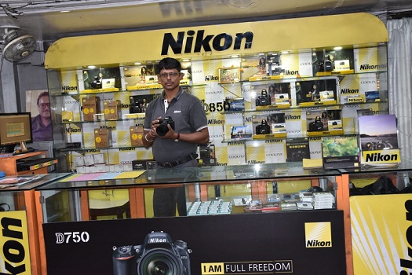

**About:** Capital Chowringhee Pvt Ltd is one of the leading retailers of electronics goods in heart of Kolkata city at 12 J.L. Nehru Road. It was founded in year 1991. Its root lies in legendry electronic retail shop of Capital Electronics. It belongs to the same family of business house which owns Capital Electronics.

**Motive**: Capital Chowringhee believes in quality and best of customer service. It does not have any branches. It occupies a space of around 1900 Sq Feet spread over ground floor and first floor for its retail business of electronic goods. We provide personalized service to customers. Our products and service offerings are most economical and good value for money which result in utmost customer satisfaction.

**Specialization**: Capital Chowringhee over a period has specialized in sales of digital cameras and photography goods and accessories. It hails from the days of optical film cameras and migrated to sale of digital camera products. Today it deals with most advanced SLR and mirrorless cameras, video cameras and lenses and accessories of almost all reputed brands.

**Photography**: Capital Chowringhee has several eminent and famous photographers are its customers. Several photography workshops are conducted in the shop and out in the open at regular basis and renowned photographers and instructors from Canon, Nikon and Sony become part of it. We invite existing customers and enthusiasts from public to participate in these workshops which are subsidised heavily by us and by parent companies.

**Associations**: Capital Chowringhee has its associate “Billenium Sales and Service Pvt Ltd” as authorized Nikon service centre at corner of first floor hence facilitating customers for both sales and service of Nikon cameras at the same place. We also have close tie-ups and association with Casio authorized service centre at first floor of the shop. All Casio calculators, music synthesizers, organs watches, projectors are repaired here. We have close association and tie ups with Sony authorized service centre of “Nav technology Pvt ltd” at 130A Bagmari Road, SCH -VIIM, Kol -700054 wherein we have the same owners.

**Other items**: Capital Chowringhee also sells LED TV, Refrigerators, Washing Machines, music systems, Cellular phones, audio and video products and accessories, wide range of earphones and headphones, computers, laptop and accessories, domestic and beauty products, watches and other electronic items.

**Software**: Capital Chowringhee is also present in Software Development business in name of Kush Infotech at 92/2A Bidhan Nagar road, wherein we specialize in creation of modern software applications in latest cutting-edge web technology.

**History**: At the present place of Capital Chowringhee originally there was Capital Watch Company sometime in year 1960. It used to deal with repairing of watches and sale of photography goods. 

**Later**, it started selling watches also. Soon it became famous for sales and service of watches in Calcutta. In 1972 Capital Electronics was formed at the same place in partnership of three brothers Shri Anand Swaroop Agarwal, Shri Krishna Swaroop Agarwal and Shree Rajendra Swaroop Agarwal. 

The showroom was inaugurated by **Shree Ratan Tata** of Tata Group of industries. At that time the shop only had Nelco radio and HMT watches. 

The business flourished. At the advent of Black And White TV’s the shop Capital Electronics started to keep TV’s. Soon there came the color TV. 

This was real boom time for the business. There was less competition, and everybody wanted color TV.

Soon there were other branches / showrooms of **Capital Electronics at VIP Road, Behala, Howrah and Gariahat road** of Kolkata and the story of expansion of Capital Electronics  is already known to the people of Kolkata.
